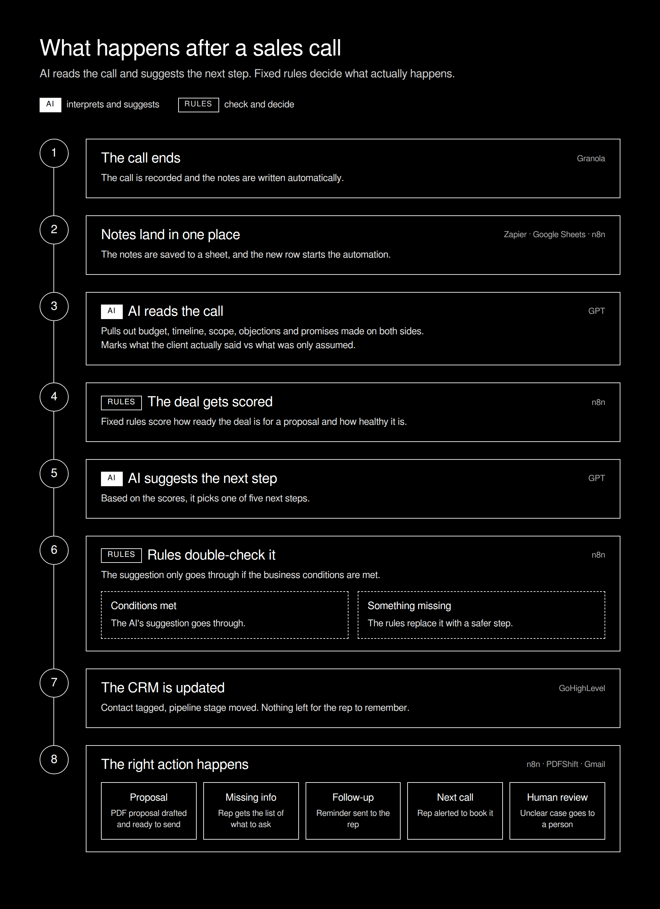
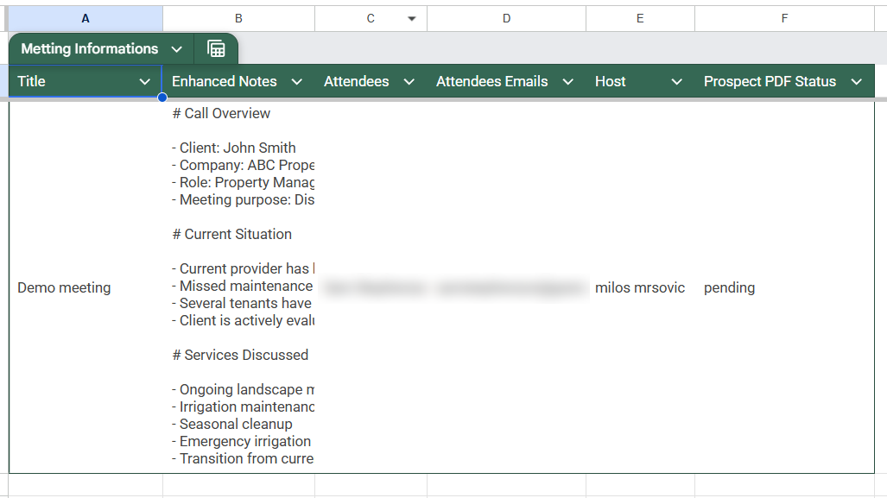
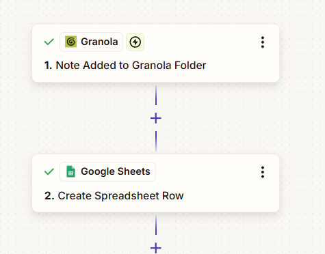
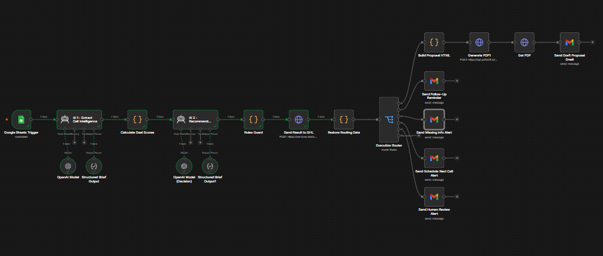
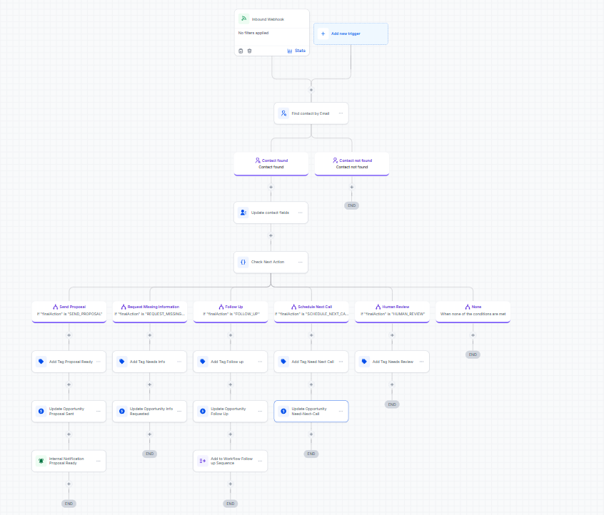
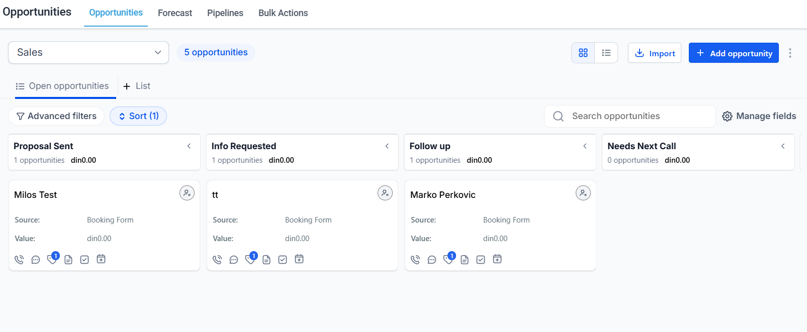

# AI Post-Call Sales Automation

An AI-assisted sales automation system that turns post-call notes into structured deal intelligence, evaluates proposal readiness, recommends the next action, and routes the opportunity through a rules-based execution layer.

**The key design decision:**

> **AI can recommend an action. It does not get to decide whether that action should execute.**

Built with **n8n, GPT, Granola, Zapier, PDFShift, and GoHighLevel.**

---

## The Problem

The sales process does not end when the call ends.

A rep may have promised a proposal, asked for missing information, scheduled another conversation, or identified an unresolved objection.

But after the call, the CRM often contains little more than a stage change and a few notes.

The result:

* Follow-ups get delayed
* Proposal commitments are forgotten
* Important context stays buried in call notes
* CRM records become incomplete
* Reps rely on memory when deciding what happens next
* Deals lose momentum after otherwise good conversations

This system is designed to close that gap.

---

## What This System Does

After a sales call, the workflow takes the call notes and turns them into structured sales intelligence.

It then:

1. Extracts relevant facts from the conversation
2. Separates client-stated information from assumptions or interpretations
3. Calculates proposal readiness and deal health using deterministic rules
4. Uses AI to recommend the most appropriate next action
5. Validates that recommendation against explicit business rules
6. Routes the opportunity to the appropriate workflow
7. Updates the CRM
8. Escalates ambiguous cases for human review

The result is **AI-assisted analysis combined with deterministic execution logic**.



---

## How The System Works

The workflow starts with the notes from a completed sales conversation.

### 1. Call Notes

Granola provides the post-call notes that become the initial input.



The notes contain the context that would normally remain buried inside the sales rep's meeting notes.

---

### 2. Input & Workflow Orchestration

Zapier pushes the call notes into a Google Sheet. Each new row triggers the n8n workflow.



From there, n8n orchestrates the processing, analysis, decision logic, and CRM actions.



---

## The Core Design

The important part of this system is not simply that AI reads a call.

The workflow separates:

**Extraction → Scoring → Recommendation → Validation → Execution**

This creates a clear boundary between what AI is responsible for and what business rules control.

---

### Layer 1: AI Extraction

The first AI step extracts structured information from the conversation.

Examples include:

* Budget
* Timeline
* Scope
* Decision maker
* Objections
* Requirements
* Missing information
* Client commitments

The extraction layer also distinguishes between **what the client actually stated** and what was inferred.

For example:

```text
Budget:
$7,000/month

Classification:
CLIENT_STATED

Evidence:
"We're spending around $7,000 a month right now."
```

Compared with:

```text
Budget:
$7,000/month

Classification:
REP_INFERRED

Evidence:
No explicit budget statement found.
```

Those two situations should not be treated as equivalent.

---

### Layer 2: Deterministic Scoring

The extracted information is evaluated using explicit business conditions.

Examples:

* Is the budget sufficiently confirmed?
* Is the required scope understood?
* Is the timeline established?
* Is the decision maker identified?
* Are important objections unresolved?
* Is enough information available to prepare a proposal?

These conditions contribute to:

* **Proposal Readiness**
* **Deal Health**

The scoring layer provides a consistent foundation before the AI recommendation is made.

---

### Layer 3: AI Recommendation

The structured information and scoring results are then passed to the recommendation layer.

The AI recommends the most appropriate next action.

Possible recommendations include:

```text
SEND_PROPOSAL
REQUEST_MISSING_INFORMATION
FOLLOW_UP
SCHEDULE_NEXT_CALL
HUMAN_REVIEW
```

The important part:

**The recommendation is not the final decision.**

---

### Layer 4: Rules Guard

This is where the system deliberately limits AI autonomy.

The AI recommendation is checked against deterministic business rules before anything is executed.

For example:

```text
AI Recommendation
        ↓
SEND_PROPOSAL
        ↓
Rules Guard
        ↓
Required information missing
        ↓
OVERRIDE
        ↓
REQUEST_MISSING_INFORMATION
```

So even if the model recommends sending a proposal, the system can prevent that action when required conditions are not satisfied.

This gives the workflow a simple principle:

> **Use AI where interpretation is useful. Use deterministic logic where control matters.**

---

## Example Decision

A call may produce:

```text
Proposal Readiness: 65
Deal Health: 50

AI Recommendation:
SEND_PROPOSAL
```

But the rules layer detects that an important piece of information is still missing.

The final result becomes:

```text
Rules Guard:
OVERRIDDEN

Final Action:
REQUEST_MISSING_INFORMATION
```

The AI is therefore part of the decision process without being given unrestricted control over execution.

---

## Possible Outcomes

The execution router can send the opportunity into one of several paths.

### `SEND_PROPOSAL`

The configured proposal conditions have been satisfied.

The proposal workflow can continue.

### `REQUEST_MISSING_INFORMATION`

The opportunity is not sufficiently defined.

The workflow identifies the information that still needs to be confirmed.

### `FOLLOW_UP`

The deal remains active but requires a follow-up action.

### `SCHEDULE_NEXT_CALL`

The conversation indicates that another call is required before progressing.

### `HUMAN_REVIEW`

The information is ambiguous, contradictory, or does not safely satisfy the configured conditions.

---

## CRM Integration

The final state is reflected back into the sales CRM.



The system can work with:

* Contacts
* Opportunities
* Pipeline stages
* Tags
* Sales follow-up state
* Next-step routing

The opportunity can therefore move from **conversation → analysis → decision → CRM action** without requiring the rep to manually reconstruct the entire conversation.

---

## Pipeline Context

The automation is designed around the opportunity lifecycle rather than treating the call as an isolated event.



The post-call workflow sits between the sales conversation and the next pipeline action.

```text
LEAD
  ↓
PRE-CALL INTELLIGENCE
  ↓
SALES CALL
  ↓
POST-CALL INTELLIGENCE
  ↓
FOLLOW-UP / PROPOSAL / NEXT CALL
  ↓
PIPELINE
```

---

## Example Output

Real output from the demo call used in this repo.

**Extraction** (shortened, full file: [`sample_output1.json`](sample_output1.json)):

```json
{
  "budgetValue": "7000/month",
  "budgetClassification": "CLIENT_STATED",
  "budgetEvidence": "We're spending around 7000 a month right now",
  "timelineValue": "October",
  "timelineClassification": "CLIENT_STATED",
  "timelineEvidence": "We'd like to switch in October",
  "decisionMakerPresent": true,
  "objectionsRaised": ["Wants to compare with current provider"],
  "clientCommitments": ["Send property measurements by Friday"],
  "salesCommitments": ["Prepare and send proposal by Monday"],
  "missingInformation": ["Exact property size"],
  "unresolvedObjection": false
}
```

**Recommendation** ([`sample_output2.json`](sample_output2.json)):

```json
{
  "recommendedAction": "REQUEST_MISSING_INFORMATION",
  "reason": "Budget, timeline and decision maker are confirmed, but the exact property size is still missing, so a proposal cannot be priced yet.",
  "priority": "HIGH"
}
```

In this call the AI already recommends the right action, so the Rules Guard lets it through. When the AI pushes for `SEND_PROPOSAL` too early, the Rules Guard overrides it, as shown in the Example Decision above.

The important distinction is between:

**what the AI recommends**

and

**what the automation ultimately allows.**

---

## Architecture

Technical view of the same flow:


---

## Tech Stack

| Tool            | Role                                            |
| --------------- | ----------------------------------------------- |
| **n8n**         | Workflow orchestration                          |
| **GPT**         | Call intelligence extraction and recommendation |
| **Granola**     | Sales call notes                                |
| **Zapier**      | Call-note synchronization                       |
| **Google Sheets** | Call-note log and workflow trigger            |
| **GoHighLevel** | CRM, pipeline and contact updates               |
| **PDFShift**    | PDF generation                                  |
| **JSON**        | Structured data between workflow stages         |

---

## Why This Architecture

A simple implementation could send a transcript to an AI model and ask:

> "What should the sales rep do next?"

Then execute whatever the model returns.

This project intentionally avoids that architecture.

Instead:

**AI handles interpretation.**

**Rules handle control.**

That separation makes the system easier to:

* Understand
* Debug
* Audit
* Modify
* Test
* Extend

It also prevents an AI recommendation from automatically becoming a business action.

---

## What This Project Demonstrates

This project demonstrates more than AI summarization.

It combines:

* Unstructured conversation processing
* Structured AI extraction
* Fact vs assumption handling
* Deterministic scoring
* AI recommendations
* Rules-based validation
* Conditional routing
* Human-review boundaries
* CRM synchronization
* Multi-stage workflow orchestration

The AI is part of the system.

**It is not the system.**

---

## Project Structure

```text
AI-Post-Call-Sales-Automation/
│
├── screenshots/
│   ├── GHL_opportunity_stages.png
│   ├── GoHighLevel_workflow.png
│   ├── Zapier_Workflow.png
│   ├── granola_input_notes.png
│   └── n8n_workflow.png
│
├── postcall_architecture.png             # client-friendly overview
├── postcall_architecture_technical.png   # technical flow
├── sample_output1.json   # extraction output from the demo call
├── sample_output2.json   # AI recommendation for the same call
└── README.md
```

---

## Related Sales Automation

This project focuses specifically on the **post-call** part of the sales process.

It can be viewed as one component of a broader sales automation system:

```text
PRE-CALL
   ↓
Sales Intelligence
   ↓
SALES CALL
   ↓
POST-CALL
   ↓
Deal Routing
   ↓
FOLLOW-UP
   ↓
PIPELINE
```

The goal is simple:

**Don't let useful sales information disappear when the call ends.**

---

## About

Built as a portfolio project focused on practical sales process automation using n8n, CRM workflows, APIs, structured AI outputs, and deterministic business logic.
